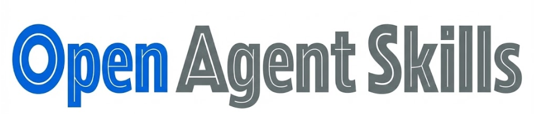
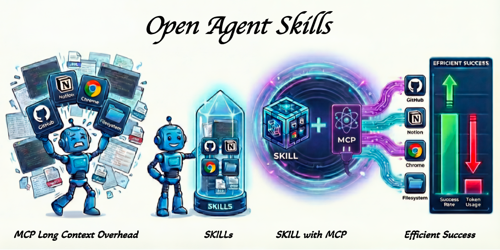
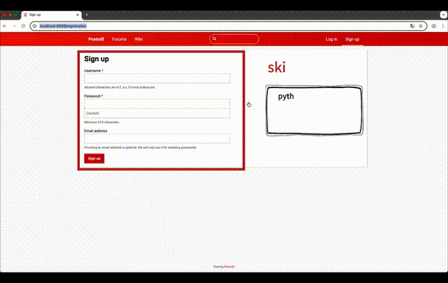
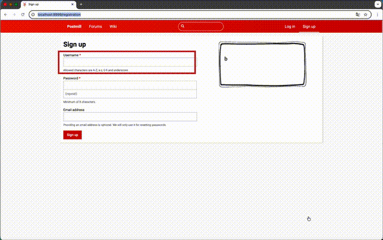
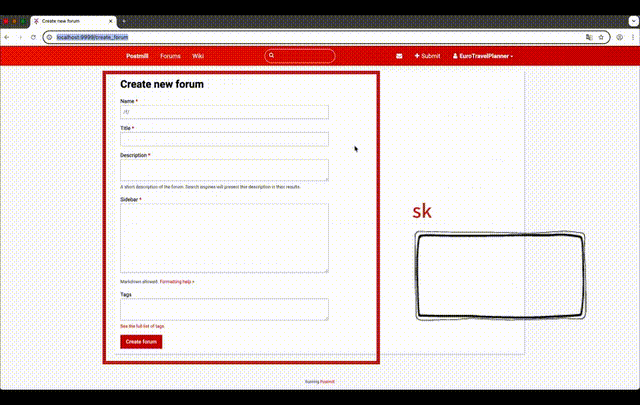
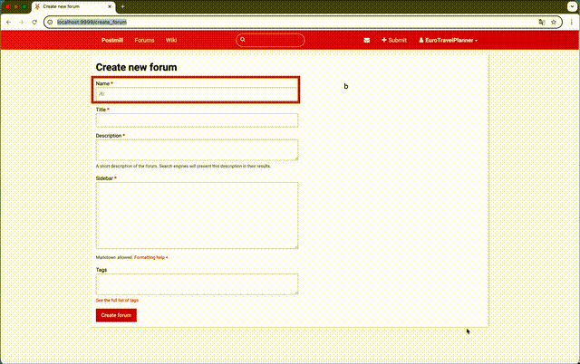
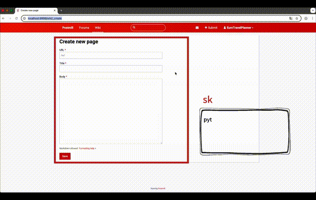
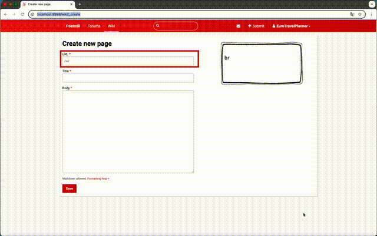
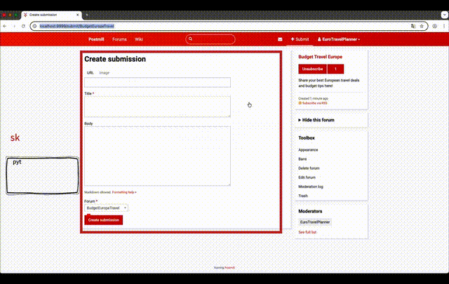
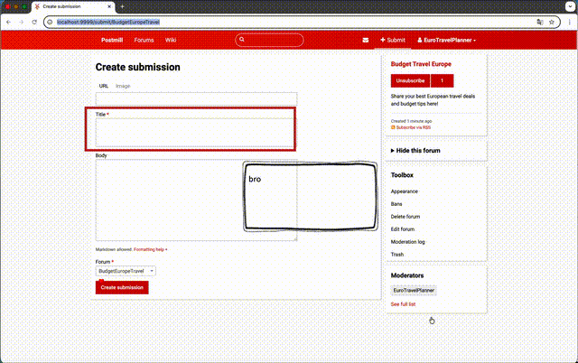

<div align="center">



**Enhancing AI Agent Efficiency Through Domain-Specific Skills**



</div>

---

> **"Model Context Protocol (MCP) connects Claude to third-party tools, and skills teach Claude how to use them well."**  
> — *[Extending Claude's capabilities with skills and MCP servers](https://claude.com/blog/extending-claude-capabilities-with-skills-mcp-servers)*, Anthropic

## 📖 Introduction

As AI agents evolve, there is a growing need for modular, reusable approaches to equip them with domain-specific expertise while mitigating issues like excessive MCP context consumption. To address this, Anthropic introduced **[Agent Skills](https://agentskills.io/home)** as an open standard on December 18, 2025, allowing agents to dynamically load structured instructions and resources for more effective task execution. Although platforms such as **[OpenAI Codex](https://developers.openai.com/codex/skills/)** have adopted this standard, native support remains limited to specific ecosystems.

However, many LLM providers have not yet adopted the Agent Skills standard, leaving this efficient approach temporarily inaccessible to a broader audience. We bridge this gap by providing a lightweight, efficient open-source framework fully compatible with the Agent Skills standard, extending these capabilities to any LLM provider. Our implementation focuses on the synergy between **Model Context Protocol (MCP)** and **Skills**: MCP provides access to external tools and systems, while Skills provide the procedural knowledge to utilize tools (including MCP) effectively. With our skill-based implementation, we achieved up to **~20x context reduction** compared to pure MCP approaches.


This project builds upon [MCPMark](https://github.com/mcpmark/mcpmark), a comprehensive evaluation suite for assessing the agentic capabilities of frontier models. We extend MCPMark's benchmark capabilities by introducing a **skill-based Implementation**.

### Key Features

- ⚡ **Lightweight Skill Implementation**: Built with a minimal framework approach, making skills implementation easy to read and quick to understand
- 🔗 **Skill + MCP Integration**: See how skills leverage MCP's external knowledge capabilities and organize multiple MCP services to collaboratively complete tasks
- 🔌 **Claude Agent Standard Compatible**: Skills can be directly executed in Claude and other compatible agent environments
- 🔀 **LLM provider Agnostic**: Not limited to Claude or Codex — any LLM can leverage skills to enhance efficiency


---

## 🛠️ Installation

### Prerequisites

- Python 3.11+
- [uv](https://github.com/astral-sh/uv) package manager (recommended, for faster installs)

### Quick Install

```bash
# Clone the repository
git clone https://github.com/zjtco-yr/open-agent-skills.git
cd open-agent-skills

# Install with pip
pip install -e .

# Or install with uv (faster)
uv pip install -e .
```

### Environment Configuration

Create a `.mcp_env` file with your API credentials:

```bash
# Example: OpenAI
OPENAI_BASE_URL="https://api.openai.com/v1"
OPENAI_API_KEY="sk-..."

# Optional: Notion (only for Notion tasks)
SOURCE_NOTION_API_KEY="your-source-notion-api-key"
EVAL_NOTION_API_KEY="your-eval-notion-api-key"
EVAL_PARENT_PAGE_TITLE="MCPMark Eval Hub"

# Optional: Playwright (only for Playwright tasks)
PLAYWRIGHT_BROWSER="chromium"   # chromium | firefox
PLAYWRIGHT_HEADLESS="True"

# Optional: GitHub (only for GitHub tasks)
GITHUB_TOKENS="token1,token2"   # token pooling for rate limits
GITHUB_EVAL_ORG="your-eval-org"
```

For more detailed environment configuration, service setup, and authentication instructions, please refer to [MCPMark](https://github.com/mcpmark/mcpmark).

---

## 📊 Performance Results

We conducted preliminary benchmark evaluations comparing MCP with Open-Agent-Skills **(Skill with MCP)** using the Claude-Sonnet-4.5 model. Results demonstrate that **Skill with MCP** achieves significant advantages in both **task performance** and **token efficiency**.

### Overall Pass@1 Accuracy

<div align="center">

| Benchmark | MCP | Skills |
|:----------|:---:|:------:|
| **GitHub** | 29.35% | **43.48%** |
| **Filesystem** | 32.5% | **53.3%** |
| **Playwright WebArena** | 32.14% | **52.38%** |

</div>

### Token Efficiency (Successful Tasks Only)

<div align="center">

| Benchmark | MCP Tokens | Skills Tokens | Reduction |
|:----------|:----------:|:-------------:|:---------:|
| **GitHub** | 6.10M | 2.47M | **59.48%** |
| **Filesystem** | 2.27M | 1.55M | **31.55%** |
| **Playwright WebArena** | 10.25M | 8.27M | **19.30%** |

</div>

### Extreme Cases

<div align="center">

| Task | MCP Tokens | Skills Tokens | Reduction |
|:-----|:----------:|:-------------:|:---------:|
| `english_talent` (Filesystem) | 1.05M | 0.053M | **95.00%** (~20x) |
| `find_commit_date` (GitHub) | 1.21M | 0.20M | **83.31%** |
| `marketing_customer_analysis`<br>(Playwright_webarena) | 1.45M | 0.67M | **54.00%** |

</div>

### Key Insights

1. **Significant Accuracy Improvement**: Average Pass@1 accuracy increased by ~**18 percentage points** across all three benchmarks
2. **Excellent Token Efficiency**: Token consumption for successful tasks reduced by **20-60%**, with extreme cases reaching **80-95%**

---

## 🎬 Demo: How Skills Work

### Example: budget_europe_travel in reddit

**Task**: This task involves multiple operations including account registration, creating posts, and setting up forums. For the complete task description, see `tasks/playwright_webarena/standard/reddit/budget_europe_travel`.

<table style="table-layout: fixed; width: 100%;">
  <tr>
    <td style="padding: 10px; width: 50%; vertical-align: top;">
      <strong>Sign Up - Skill with MCP</strong>
    </td>
    <td style="padding: 10px; width: 50%; vertical-align: top;">
      <strong>Sign Up - MCP</strong>
    </td>
  </tr>
  <tr>
    <td style="padding: 10px; width: 50%; vertical-align: top;">
      
    </td>
    <td style="padding: 10px; width: 50%; vertical-align: top;">
      
    </td>
  </tr>
  <tr>
    <td style="padding: 10px; width: 50%; vertical-align: top;">
      <strong>Create Forum - Skill with MCP</strong>
    </td>
    <td style="padding: 10px; width: 50%; vertical-align: top;">
      <strong>Create Forum - MCP</strong>
    </td>
  </tr>
  <tr>
    <td style="padding: 10px; width: 50%; vertical-align: top;">
      
    </td>
    <td style="padding: 10px; width: 50%; vertical-align: top;">
      
    </td>
  </tr>
  <tr>
    <td style="padding: 10px; width: 50%; vertical-align: top;">
      <strong>Create Page - Skill with MCP</strong>
    </td>
    <td style="padding: 10px; width: 50%; vertical-align: top;">
      <strong>Create Page - MCP</strong>
    </td>
  </tr>
  <tr>
    <td style="padding: 10px; width: 50%; vertical-align: top;">
      
    </td>
    <td style="padding: 10px; width: 50%; vertical-align: top;">
      
    </td>
  </tr>
  <tr>
    <td style="padding: 10px; width: 50%; vertical-align: top;">
      <strong>Create Submission - Skill with MCP</strong>
    </td>
    <td style="padding: 10px; width: 50%; vertical-align: top;">
      <strong>Create Submission - MCP</strong>
    </td>
  </tr>
  <tr>
    <td style="padding: 10px; width: 50%; vertical-align: top;">
      
    </td>
    <td style="padding: 10px; width: 50%; vertical-align: top;">
      
    </td>
  </tr>
  <tr>
    <td style="padding: 10px; width: 50%; vertical-align: top;">
      <strong>Full Demo - Skill with MCP</strong>
    </td>
    <td style="padding: 10px; width: 50%; vertical-align: top;">
      <strong>Full Demo - MCP</strong>
    </td>
  </tr>
  <tr>
    <td style="padding: 10px; width: 50%; vertical-align: top;">
      <video src="https://github.com/user-attachments/assets/15664a10-0cce-4241-9448-cf57ef9eade3" controls muted preload="metadata" width="100%" style="border-radius: 8px;"></video>
    </td>
    <td style="padding: 10px; width: 50%; vertical-align: top;">
      <video src="https://github.com/user-attachments/assets/b7db7bbb-dafd-42e5-8a98-75786d4640cb" controls muted preload="metadata" width="100%" style="border-radius: 8px;"></video>
    </td>
  </tr>
</table>

**Result**: Using 4 skills, achieved 2x context reduction.

### Running the Demo

```bash
# Start the browser server
uv run skills/scripts/reddit/browser_server.py &

# Execute a reddit task with skills
python -m pipeline \
  --mcp playwright_webarena \
  --models claude-sonnet-4.5 \
  --tasks reddit/budget_europe_travel \
  --exp-name skill-demo \
  --k 1
```


---

## 🚀 Future Plans

We acknowledge that the current implementation has room for improvement. This project is intended as a **starting point** to demonstrate the potential of combining MCP with domain-specific skills.

### Planned Improvements

1. **Balancing Specificity and Generalization**: While some of our skills are designed with broad applicability (e.g., Playwright-based skills for registration, posting, forum creation), others remain highly task-specific (e.g., time-based file classification in filesystem skills). We will focus on improving skill design patterns to strike a better balance between task-specific performance and cross-domain generalization.

2. **Skill-MCP Integration**: We plan to:
   - Develop better coordination patterns between skills and MCP tools
   - Enable smoother handoffs between skill scripts and MCP operations

3. **Extended Domain Coverage**:
   - Advanced database operations and Notion workspace automation
   - Common daily life use cases (productivity, personal automation, etc.)


---

## 🔒 Security

Security is a primary consideration in our skill execution framework. It inherits and leverages several security features from [MCPMark](https://github.com/eval-sys/mcpmark/), including:

- **Directory Isolation**: MCP/Skill file operations are confined to specific directories
- **Docker Containerization**: Tasks run in isolated containers

However, we strongly recommend that you **always review skill scripts** before execution in production, whether creating new skills or using existing ones.


---

## 📚 References & Resources

### Open Standards
- **[Model Context Protocol (MCP)](https://modelcontextprotocol.io/)** - Anthropic's protocol for connecting AI assistants to external tools
- **[Agent Skills Standard](https://agentskills.io/home)** - A simple, open format for giving agents new capabilities and expertise. 

### Documentation
- **[Agent Skills Overview](https://platform.claude.com/docs/en/agents-and-tools/agent-skills/overview)** - Anthropic's official guide for Claude agent skills
- **[Skills Docs](https://code.claude.com/docs/en/skills)** - Skills integration in Claude Code
- **[Skills in Codex](https://developers.openai.com/codex/skills/)** - Give Codex new capabilities with support for explicit and implicit invocation

---

## ▶️ Quick Start
After configuring the relevant APIs and Docker environment (if needed), you can run the following commands:

### Run a Playwright WebArena Task

```bash
python -m pipeline --mcp playwright_webarena \
  --models claude-sonnet-4.5 \
  --tasks reddit/marketing_customer_analysis \
  --exp-name webarena-test \
  --k 1
```

### Run a Filesystem Task

```bash
python -m pipeline --mcp filesystem \
  --models claude-sonnet-4.5 \
  --tasks student_database/english_talent \
  --exp-name filesystem-test \
  --k 1
```


## 📄 License

This project is licensed under the Apache License 2.0 - see the [LICENSE](LICENSE) file for details.

---

<div align="center">

**Open-Agent-Skills** - Making AI agents more effective through domain expertise skill

 [Report Bug](https://github.com/zjtco-yr/open-agent-skills/issues) · [Request Feature](https://github.com/zjtco-yr/open-agent-skills/issues)

</div>
